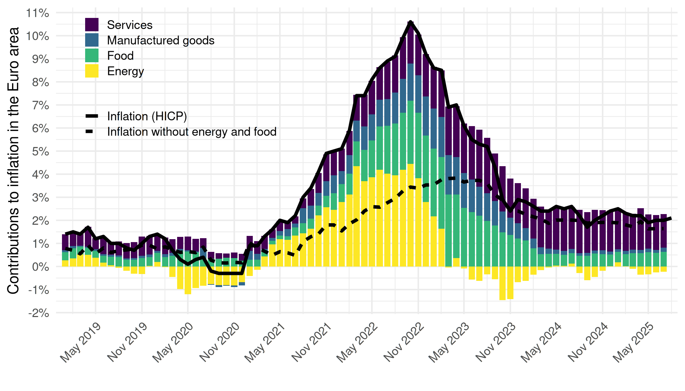
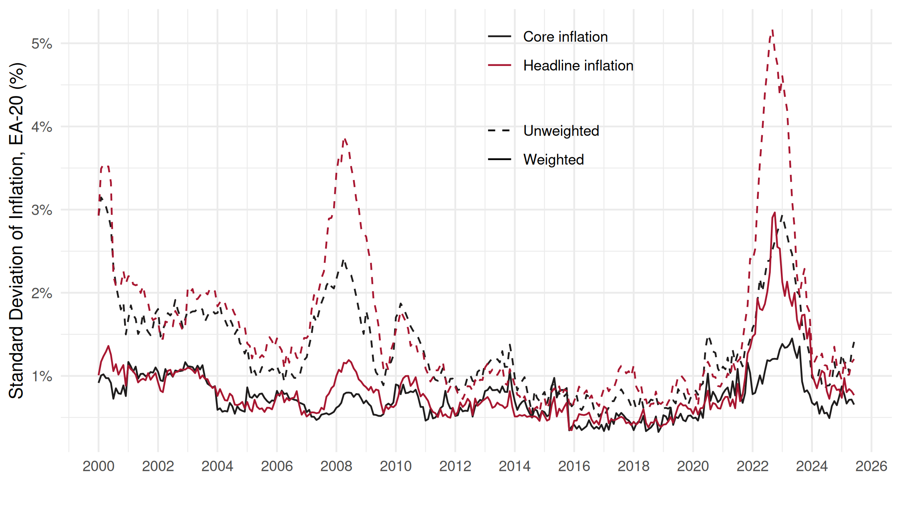
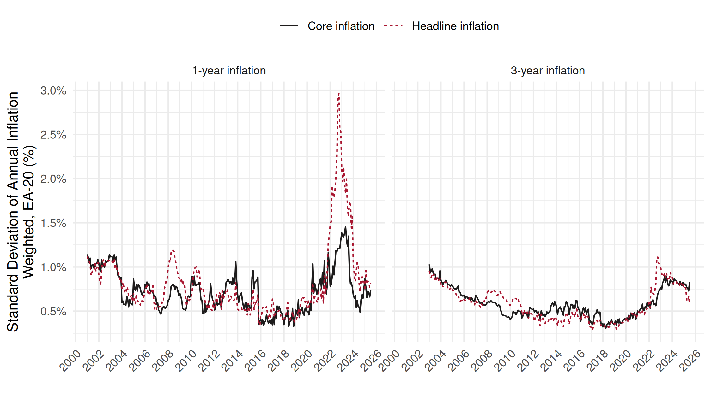
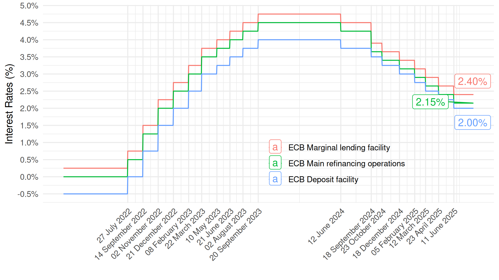
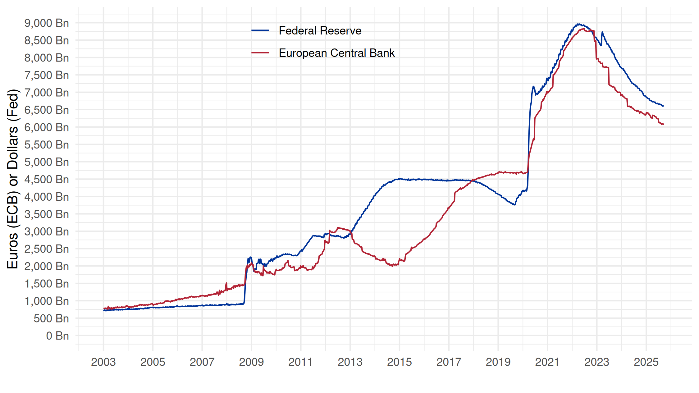
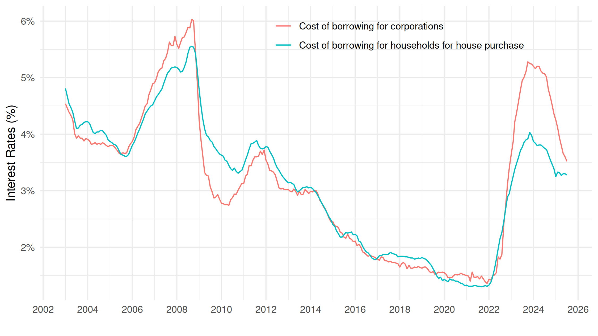
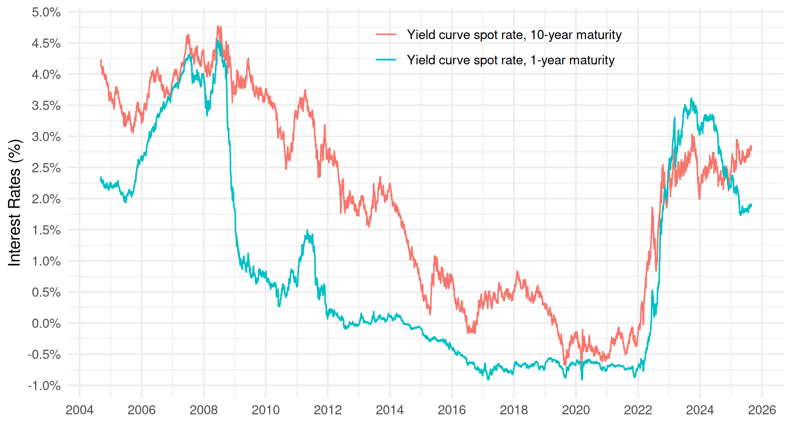

# Monetary Dialogue, June 2025

Monetary Dialogue between European Parliament's Committee on Economic and Monetary Affairs (ECON) and the European Central Bank (ECB), June 23 2025

Title: The ECB’s monetary policy stance in an uncertain environment

Authors: Christophe BLOT, Jérôme CREEL, François GEEROLF, Giovanni RICCO, Davide ROMELLI

## Replication

We provide files to replicate the data in [this working paper](https://www.europarl.europa.eu/RegData/etudes/STUD/2025/764390/ECTI_STU(2025)764390_EN.pdf):

### Figure 2: Contributions to headline inflation in the euro area, in percentage points

[R code](R/figure2.R)

### Figure 3: Weighted vs. unweighted standard deviations of 1-year inflation, in %

[R code](R/figure3.R)

### Figure 4: Weighted standard deviation of core and headline Inflation over 1 year and over 3 years (annualised)

[R code](R/figure4.R)

### Figure 5: Main interest rates and rate change dates

[R code](R/figure5.R)

### Figure 6: Size of the balance sheet of the ECB and the Fed, in billions

[R code](R/figure6.R)

### Figure 7: Composite cost of borrowing for corporations, and for households for house purchase, in %

[R code](R/figure7.R)

### Figure 8: Yield curve spot rate, 1-year maturity and 10-year maturity, in %

[R code](R/figure8.R)

