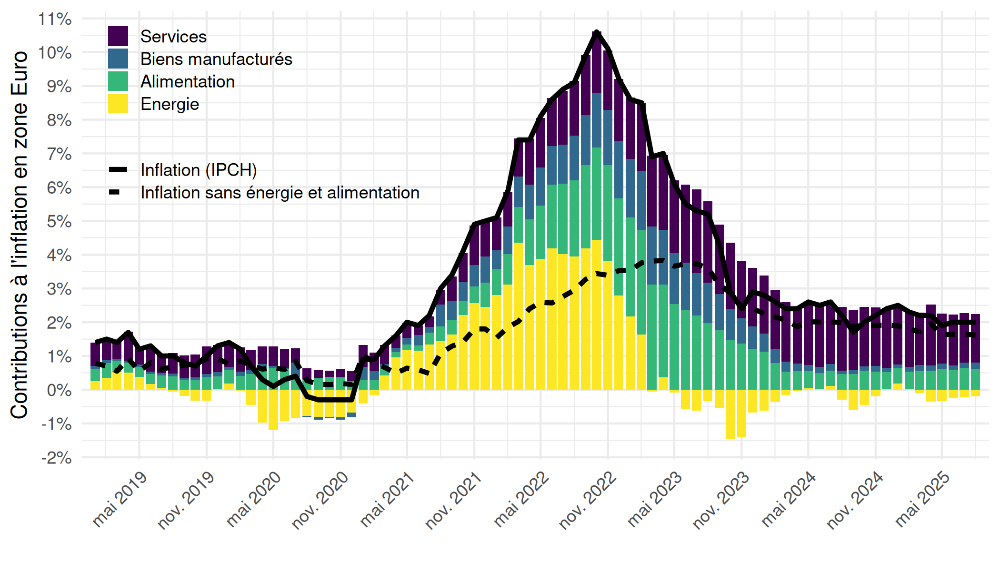
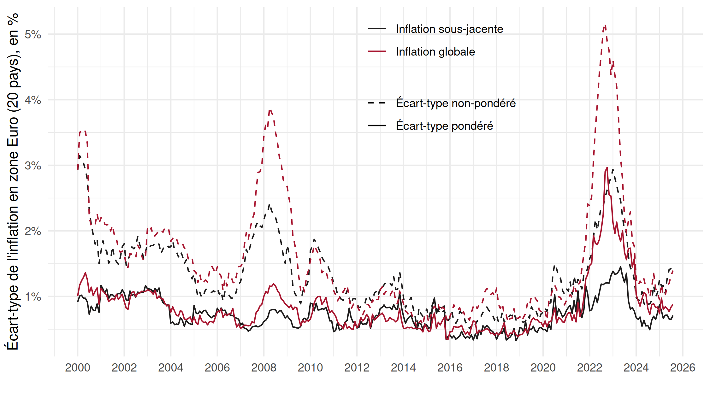
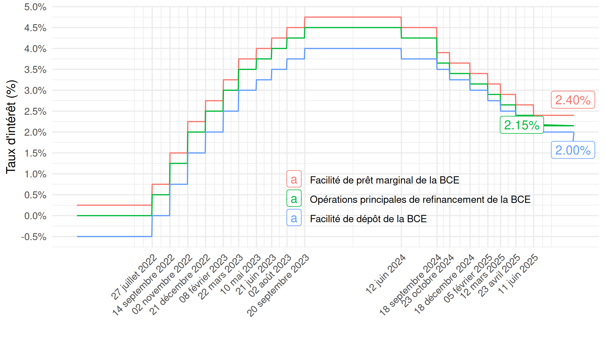
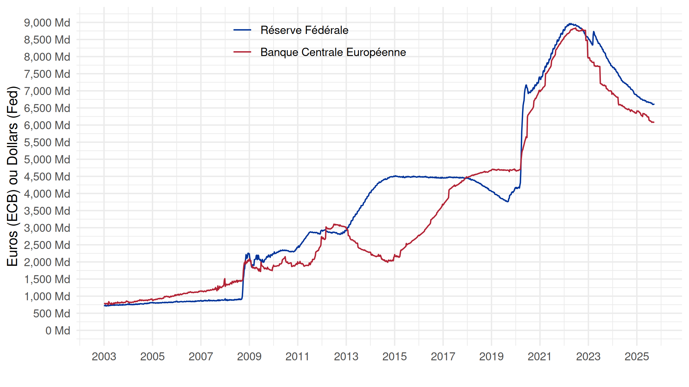
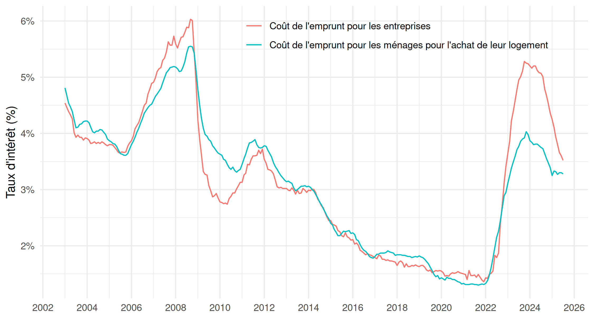
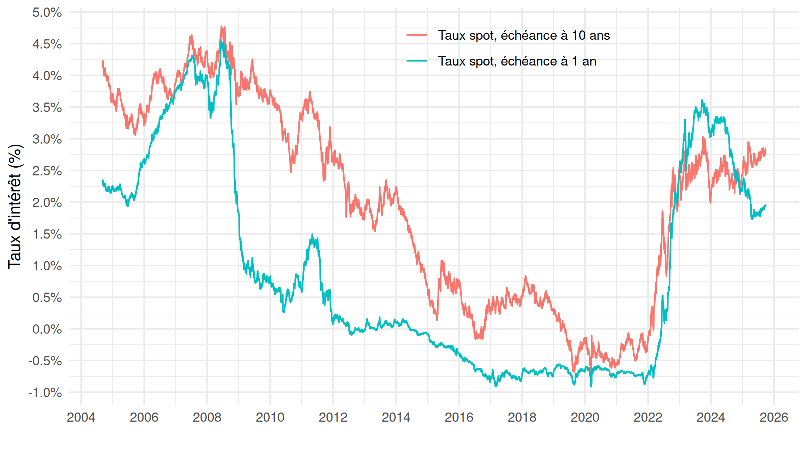

# Dialogue monétaire, juin 2025

Dialogue monétaire entre la Commission des affaires économiques et monétaires (ECON) du Parlement européen et la Banque centrale européenne (BCE), le 23 juin 2025

**Titre :** L’orientation de la politique monétaire de la BCE dans un environnement incertain

**Auteurs :** Christophe BLOT, Jérôme CREEL, François GEEROLF, Giovanni RICCO, Davide ROMELLI

## Reproductibilité

Nous mettons à disposition les fichiers permettant de reproduire les données de [ce document de travail](https://www.europarl.europa.eu/RegData/etudes/STUD/2025/764390/ECTI_STU(2025)764390_EN.pdf) :

### Figure 2 : Contributions à l'inflation globale dans la zone euro

[Code R](R/figure2.R)

### Figure 3 : Écarts-types pondérés vs. non pondérés de l’inflation à un an, en %

[Code R](R/figure3.R)

### Figure 4 : Écart-type pondéré de l’inflation totale et de l’inflation sous-jacente sur 1 an et sur 3 ans (annualisé)

[Code R](R/figure4.R)

### Figure 5 : Principaux taux directeurs et dates des changements de taux

[Code R](R/figure5.R)

### Figure 6 : Taille du bilan de la BCE et de la Fed, en milliards

[Code R](R/figure6.R)

### Figure 7 : Coût composite de l’emprunt pour les entreprises, et pour les ménages pour l’achat de logement, en %

[Code R](R/figure7.R)

### Figure 8 : Taux au comptant de la courbe des taux, échéances à 1 an et à 10 ans, en %

[Code R](R/figure8.R)

